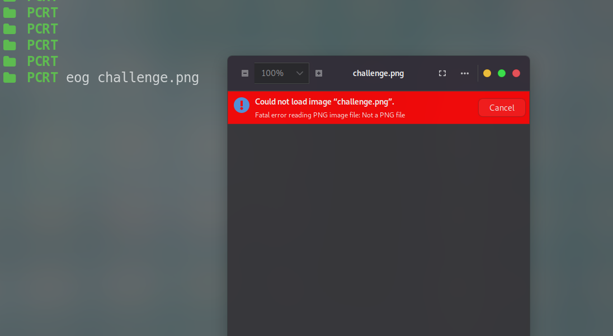
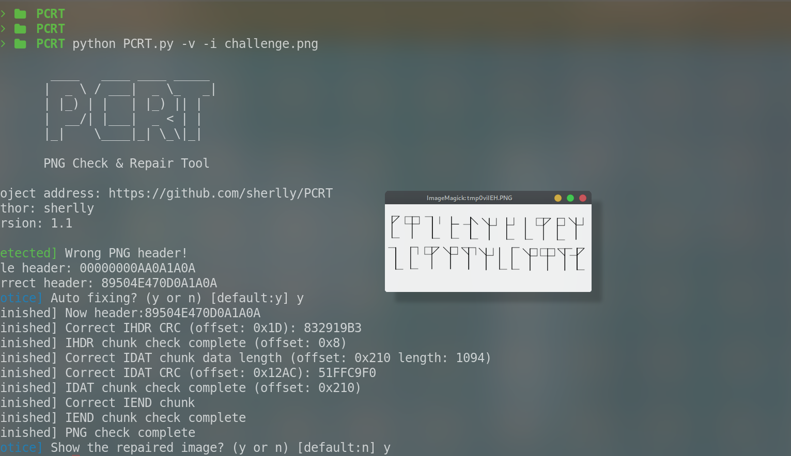
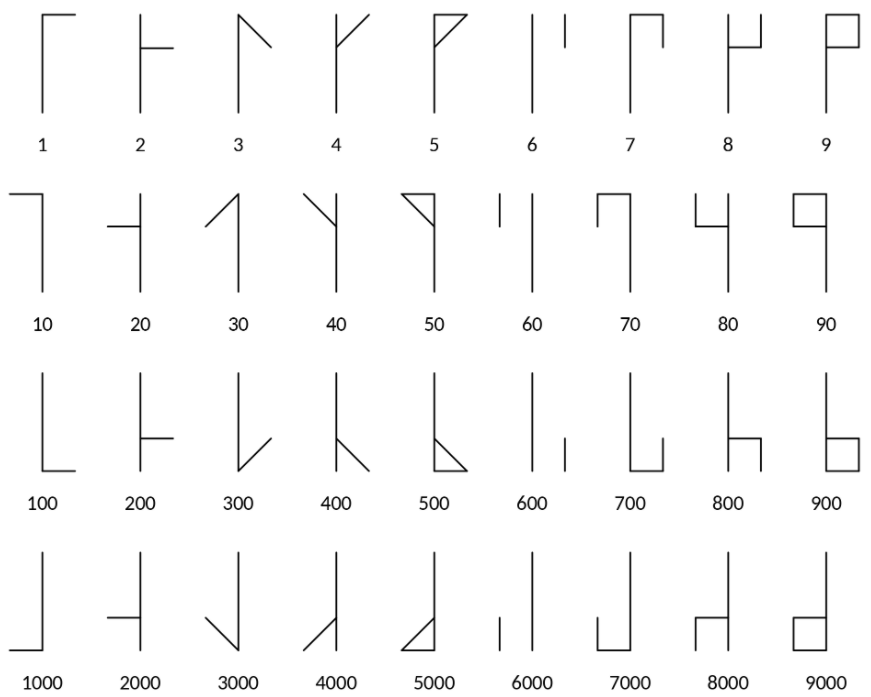
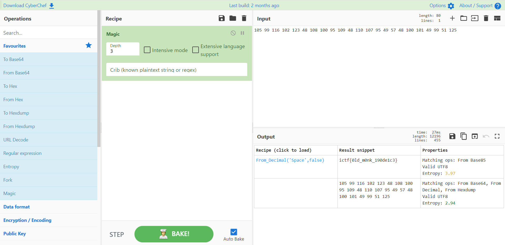

## Ancient

in the description there was a file given called `Challenge.png` but when i tried to open it , 
it showed not a valid png ,



so i checked the Header of that png & its seemed corrupted
so i used a Tool called `PCRT` which fixes png header automatically.
```http
https://github.com/sherlly/PCRT
```


finally the png loaded , the image was containing some type of symbol cipher it seemed to me,
so after alot of googling & the chall title was `Ancient` i found out its `Old Monk Cipher` . so used its manual page & got the values corresponding to our challenge image




put those values in `CyberChef` & Bake with Magic Module

Boom got the flag


