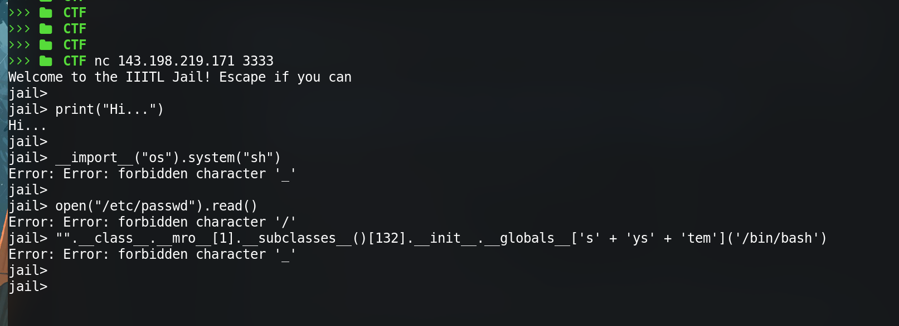

## Connect to the jail via nc

```sh
$ nc 143.198.219.171 3333
```

i saw it was a python jail escape challenge , so i tried multiple bypass payloads but noticed a similar pattern in every payload that its 
blacklisting `_` , `/` , `;` , `+` , `open` , `eval` , `exec` .


