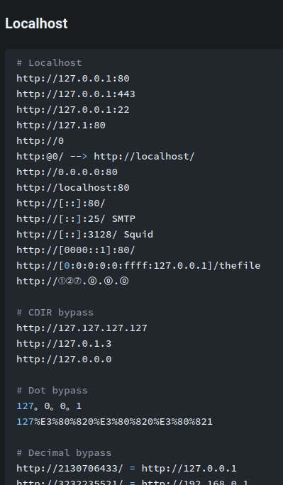
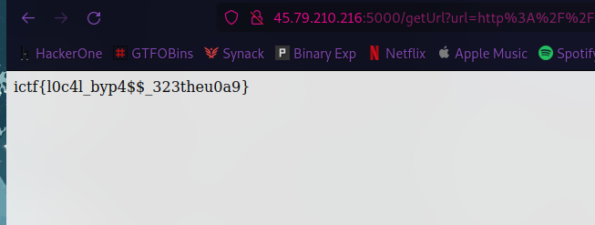

### Challenge Description


### Homepage


it seems like it may be vulnerable to SSRF (Server-Side Request Forgery)! Which means we can try to reach internal services!

so lets try Hacktricks



so after few trial & error this payload seemed to be working :
```http
http://127.1:9001/flag.txt
```


### Got the flag


