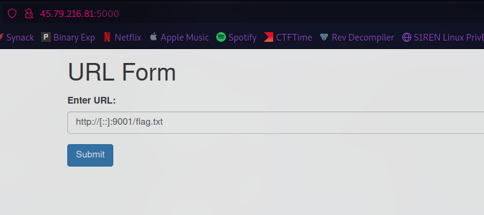
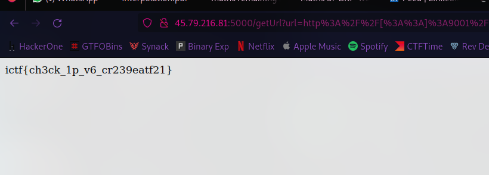

### Challenge Description


### HomePage

So this challenge is almost the same as the “get flag 1” challenge, which is a SSRF localhost filter bypass.

again after trying diff payloa this one seemed to be working :

```http
http://[::]:9001/flag.txt
```



### The Flag


