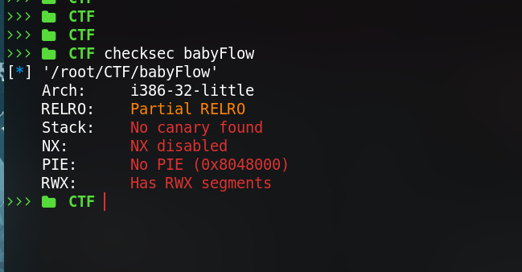
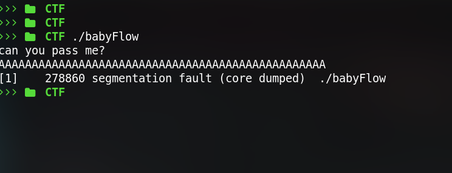
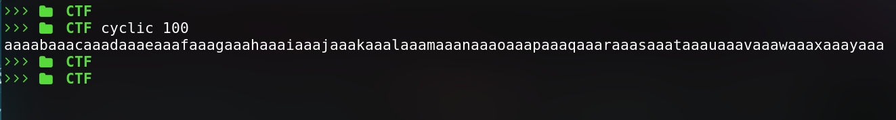
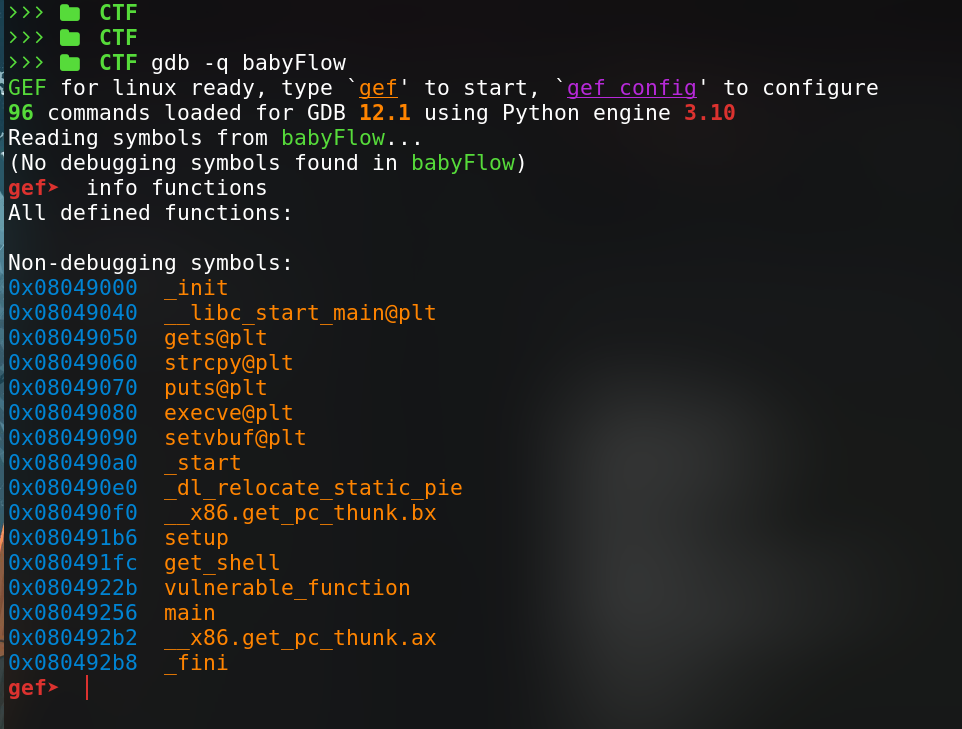

## Static Analysis

lets check the given binary with `checksec` & see what protections are there in the binary 

no Canary , no PIE , no NX enabled. so it should be a simple buf. well lets try 

as expected `Segment fault`.

lets see whats happening when given overflow input using `gdb`

