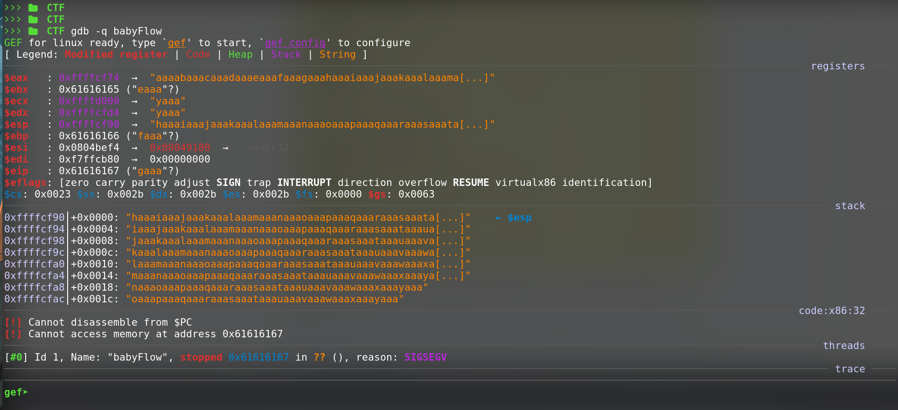
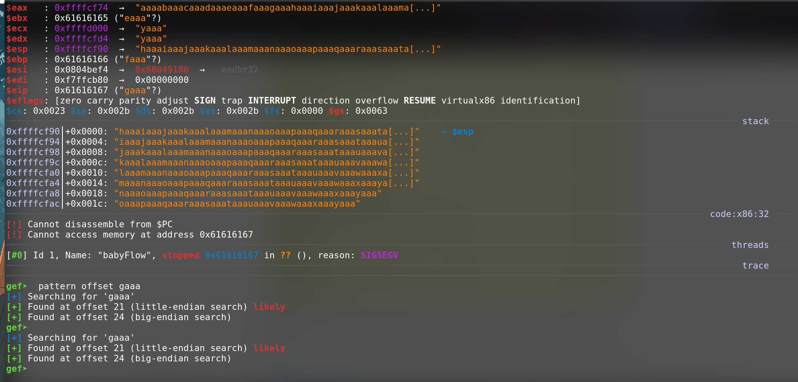
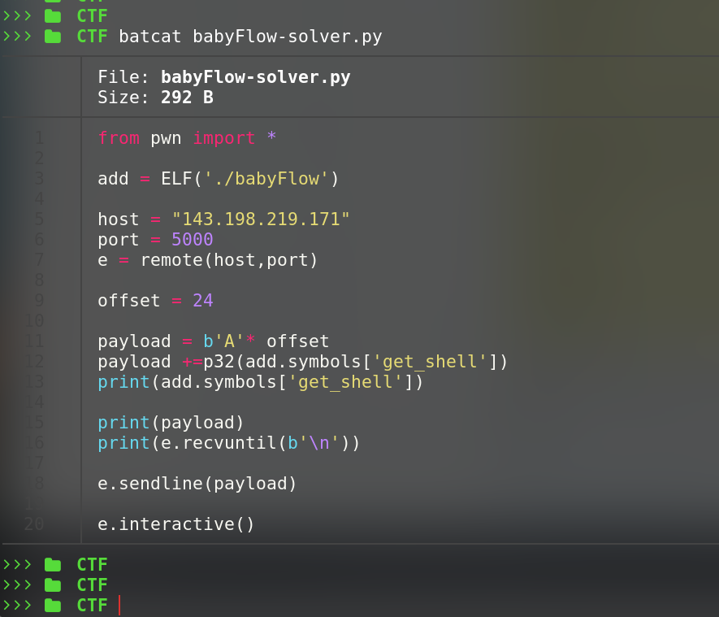
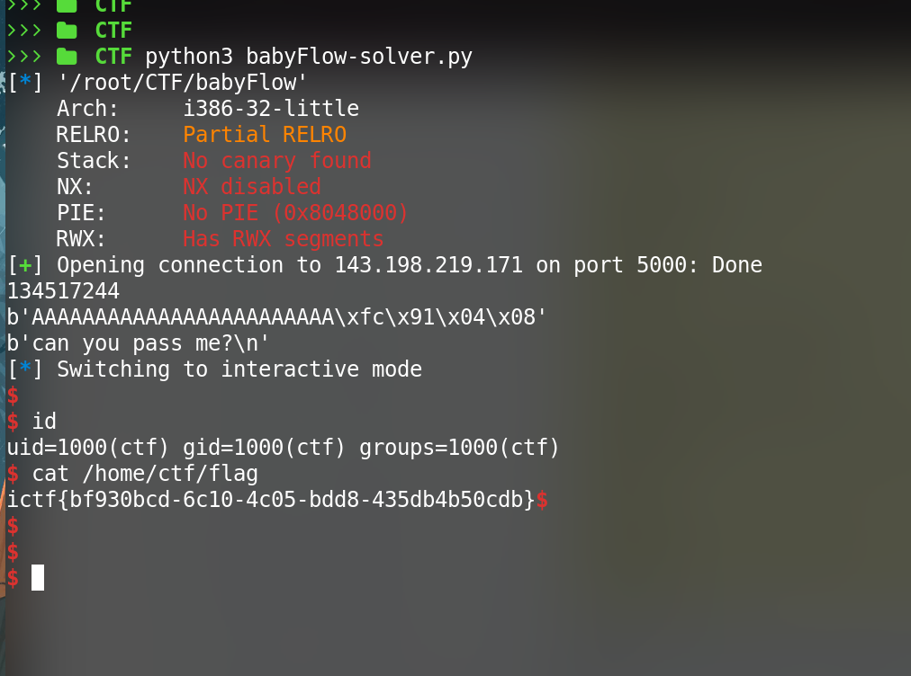

## Static Analysis

lets check the given binary with `checksec` & see what protections are there in the binary 

no Canary , no PIE , no NX enabled. so it should be a simple buf. well lets try 

as expected `Segment fault`.

First let us check the functions of this binary .

we can see there;s a `get_shell` function. seems interesting & another called `vulnerable_function`

lets see whats happening when given overflow input using `gdb`

we can see $eip is overwritten with `gaaa` . lets find out the offset for it

okay so we got the offset `24` .

let us craft our exploit with offset as 24 + A's & then invoke `get_shell` function to get us a shell.

## Exploit

